### Bio O notation

Fala sobre escalabilidade e não sobre desempenho

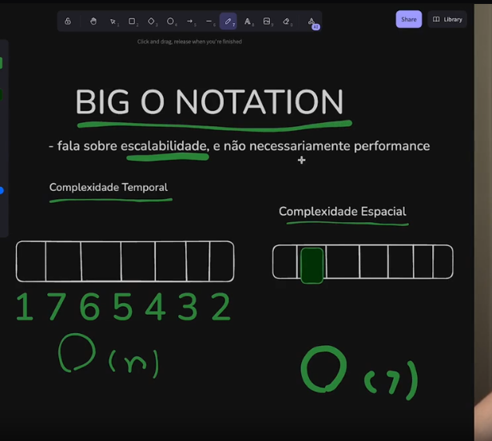

- Escala logaritimica
- Complexidade temporal: tem a ver com tempo de acordo com o input
- Complexidade espacial: Tem a ver com quanto de memoria o algoritimo usa.
- O(1) tempo constante ou memoria constante examplo pegar o primeiro elemento de um array
- O(n log n) geralmente merge sorte e divide conquer
- O(n) escala exatamente na proporção que o input aumenta
- O(n^2) for encadeado

### Arrays

No javascript arrays são na verdade objetos complexos e não arrays

No rust ele precisa saber exatamente qual o tamanho devem ter os arrays, para fazer o gerenciamento de memoria com mais desempenho

<figure>
  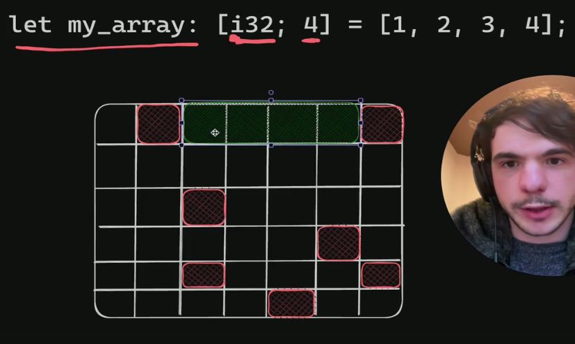
  <figcaption>
    Alocação de memoria
  </figcaption>
</figure>

### Algoritimos:

#### Two points
- São dois ponteiros que apontam cada um para a extremidade esquerda e direita do array
- Pode ser usado para reverter um array de palavras

<figure>
  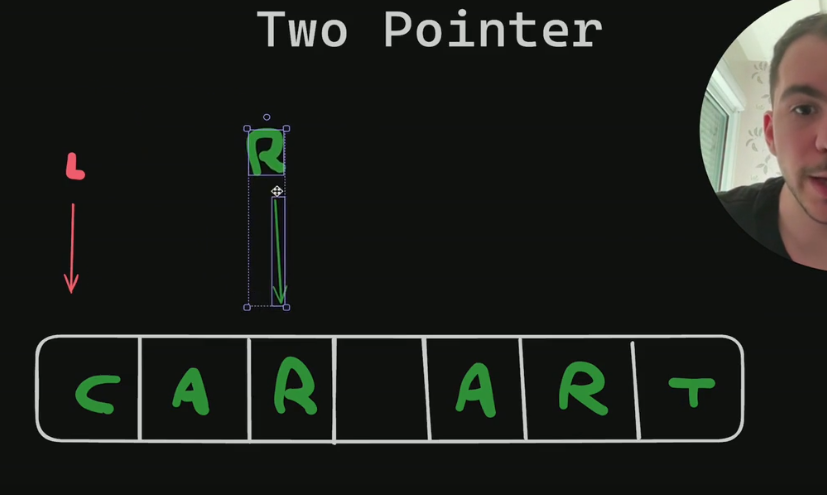
  <figcaption>
    Alocação de memoria
  </figcaption>
</figure>

#### Binary Search
- Divide a coleção pela metade e vai dividindo até encontrar o item
- Precisa que o array esteja ordenado
- Temporal: O(log n)
- Espacial: O(1)
- Utilizamos o [log2 n](https://pt.khanacademy.org/computing/computer-science/algorithms/binary-search/a/running-time-of-binary-search) para descobrir o número de passos necessários e descobrir o tempo de execução
- fonts:
  - https://www.khanacademy.org/computing/computer-science/algorithms/binary-search/a/binary-search

#### Sliding window

- Possui dois for encadeado, um abrindo e outro fechando e fazendo checagens

<figure>
  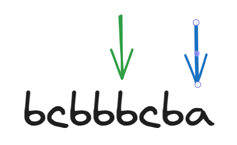
  <figcaption>
    Ponteiros
  </figcaption>
</figure>

#### Exponential Search
- Utiliza a binary search para fazer a busca apos encontrar o range

#### Hashmap

- 

---

#### Linked Lists

- É importante para linguagens mais staticas que definem o tamanho do array na inicialização por exemplo com a linked list é possivel aumentar a lista dinamicamente
- Double linked lista é quando o no sabe o prev e o next
- A parte ruim é não ter acesso via index [n]

---

#### Queue

- usa FIFO first in first out
- Utiliza geralmente uma linkedlist

---

#### Hashmap

- tem a complexidade O(1)
- load factor 70%
- collisions

---

#### Stack

- Utiliza o LIFO last in last out

---

#### Trie

- Usada para autocomplete

---

#### B-tree

-

### Recursive

- Funções recursivas são funções que chamam a elas mesmas, com isso uma stack de chamadas é criada no programa
- É preciso encontrar um **caso base** é o que acontece na potenciação onde todo numero elevado a 0 é igual a 1 isso faz a recursão retornar. Basicamente a recursão seria solucionar um sub problema que é uma instancia menor do problema e com a solução solucionar o problema.
- fonts:
- https://pt.khanacademy.org/computing/computer-science/algorithms/recursive-algorithms/a/recursion
- https://pt.khanacademy.org/computing/computer-science/algorithms/recursive-algorithms/a/improving-efficiency-of-recursive-functions

Em algumas situações pode ser interessante utiliza memoization para otimizar as chamadas para funções recurssivas como no caso do fibonnaci que alguns valores se repetem. ou mesmo uma solução interativa com *for* por exemplo

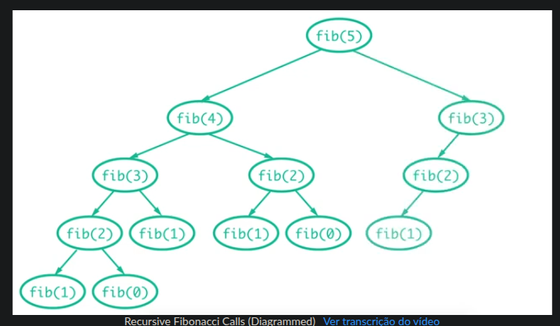

### Sorting

#### Bubble sort

- Complexidade temporal O(N^2)
  - Melhor cenario O(n)
- Espacial O(1)
- Pouco eficiente para os dias de hoje porem pode ser usado para arrays menores com 100 itens por exemplo
- fonts:
  - https://cs50.harvard.edu/x/2025/shorts/bubble_sort/

#### Insertion Sort

- https://www.w3schools.com/dsa/dsa_algo_insertionsort.php
- https://www.khanacademy.org/computing/computer-science/algorithms/insertion-sort/a/insertion-sort

<figure>
  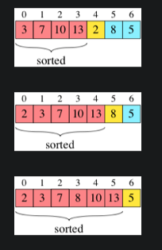
  <figcaption>
    Quick sort
  </figcaption>
</figure>

#### Selection Sort

- https://www.w3schools.com/dsa/dsa_algo_selectionsort.php
- https://www.khanacademy.org/computing/computer-science/algorithms/sorting-algorithms/a/sorting

<figure>
  
  <figcaption>
    Quick sort
  </figcaption>
</figure>

#### QuickSort

- Precisa escolher o pivot e ai dividir o array de um lado fica os menores e do outro os maiores que o pivot
  - A ideia é ir dividindo o array em dois recursivamente de acordo com o pivo
- Temporal: No melhor e medio caso N log n no pior n ** 2
- Espacial: No melhor log N no pior n
- fonts:
  - https://pt.khanacademy.org/computing/computer-science/algorithms/quick-sort/a/linear-time-partitioning

<figure>
  
  <figcaption>
    Quick sort
  </figcaption>
</figure>

#### MergeSort
- Temporal: O (n log n)
- Espacial: O(n)
- As etapas para solução são dividir, conquistar e combinar.
- fonts:
  - https://pt.khanacademy.org/computing/computer-science/algorithms/merge-sort/a/overview-of-merge-sort
  - https://www.youtube.com/watch?v=Ns7tGNbtvV4

<figure>
  
  <figcaption>
    Dividir e conquistar
  </figcaption>
</figure>

<figure>
  
  <figcaption>
    Mais sobre dividir e conquistar
  </figcaption>
</figure>

### Binaries

- Transformação de binario para decimal
  - Cada casa vale 2 na potencia de 1,2,3,4...
  - O ultimo bit mais a esquerda é o sinal do binario - ou +
  - O bit de paridade é o primeiro bit direita se ele for um o binario é impar se for zero par
- Em algumas linguagens de programação o decimal é representado por 32 bit
- MSB
  - LSB(least significant bit) geralmente é o bit mais a direita e MSB(most significante bit) é o bit mais a esquerda
  - LSB é o menor valor e MSB o maior valor
  - Font: https://www.techtarget.com/whatis/definition/most-significant-bit-or-byte

<figure>
  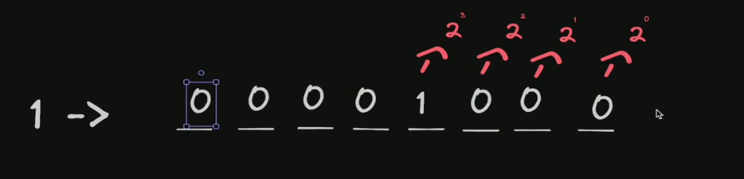
  <figcaption>
    Representação do binario
  </figcaption>
</figure>

#### Left/Right shift

Left(<<)
Right(>>)

- Move os bits para a direita e esquerda
  - Com numeros que não dão overflow, o shift n << 1 vai duplicar o numero
  - Ja o n >> 1 dividi o numero por dois a não ser que aconteça o overflow

<figure>
  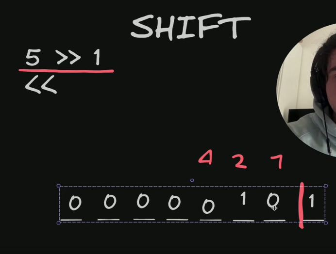
  <figcaption>
    Shift
  </figcaption>
</figure>

#### And OR Not and XOR

<figure>
  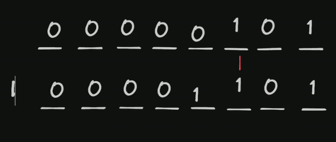
  <figcaption>
    Shift
  </figcaption>
</figure>

And(&)

- Caso o bit atual seja 1 em ambos os casos ele retorna um
- Caso queira saber se um numero é par basta apenas testar ele com o 1 exemplo 5 & 1 caso retorne 1 é impar 
- caso retorne 0 é par isso por estar testando o ultimo bit o bit de paridade

Or(|)

- Caso pelo menos um dos bits testados sejam 1 ele retorna true
- Exemplo: 010 | 001 = 011

Xor(^)

- O xor apenas é 1 quando ambos os bits avaliados são diferentes
- Xor de um numero com ele mesmo sempre é 0
  - Xor de um numero com 0 é ele mesmo
- é cumulativo e associativo
- Exercicios: https://www.youtube.com/watch?v=WnPLSRLSANE1
- Exemplo: 001 ^ 000 = 001

<figure>
  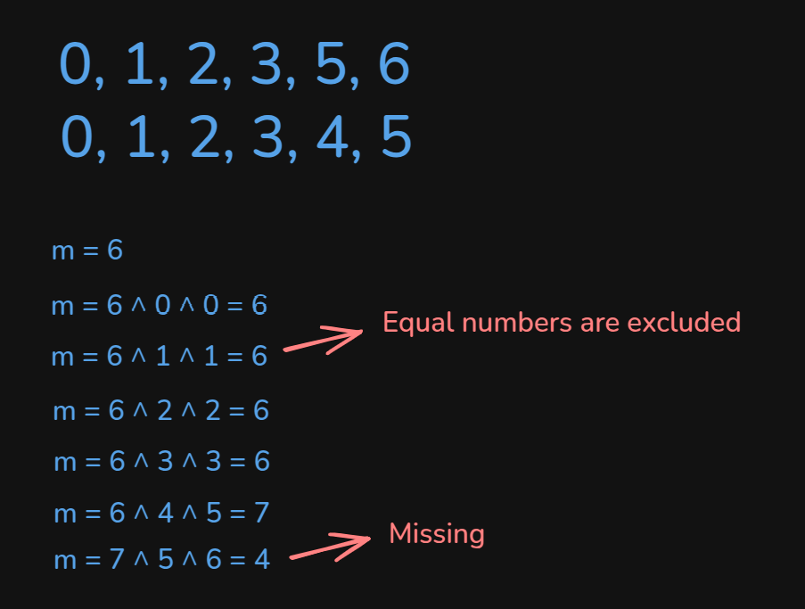
  <figcaption>
    Missing numbers implementation
  </figcaption>
</figure>

Not(~)

- Basicamente invert todos os bits onde for 0 fica 1 onde for 1 fica zero
- Exemplo: ~101 = 010 

### Binary tree

- Precisa de um tree node e da binary tree em si
- Geralmente são colocados valores numericos como nodes
- Na busca e inserção de dados é feito por um lado da binary

<figure>
  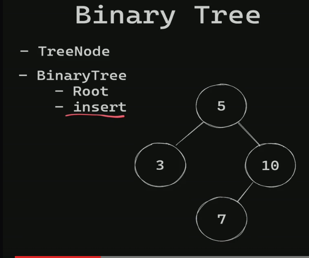
  <figcaption>
    binary tree
  </figcaption>
</figure>

#### Traversals (similar a DFS)

Preorder traversal

- Preorder começa no root e vai seguindo pela esquerda depois volta e vai pela direita dos nodes

<figure>
  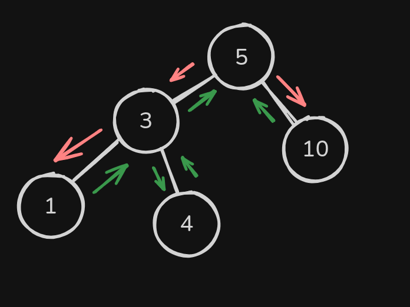
  <figcaption>
    preorder traversal
  </figcaption>
</figure>

Inorder traversal

- O root fica no meio do retorno
- Abri tudo a esquerda e so depois adiciona ao resultado, um pouco parecido com o preorder porem o momento de inserção no resultado é outro

<figure>
  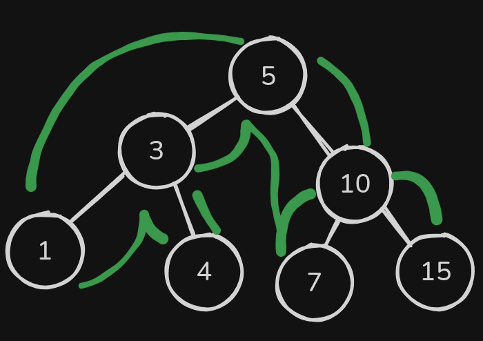
  <figcaption>
    inorder traversal
  </figcaption>
</figure>

Postorder traversal

- O root fica no final
- A execução é parecida com as outras porem agora o root será o último a ser adicionado
- É melhor para poupar memoria com diminuição da callstack

<figure>
  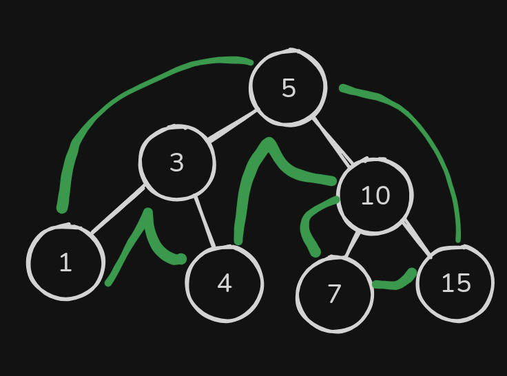
  <figcaption>
    postorder traversal
  </figcaption>
</figure>

BFS - breath first seach

- Basicamente faz uma busca por nivel ao inves de por pr
    }ofundidade, e vai visitando cada item
- Para isso é usado um deque()
- Pega o root, dai verifica left e right dele e assim por diante

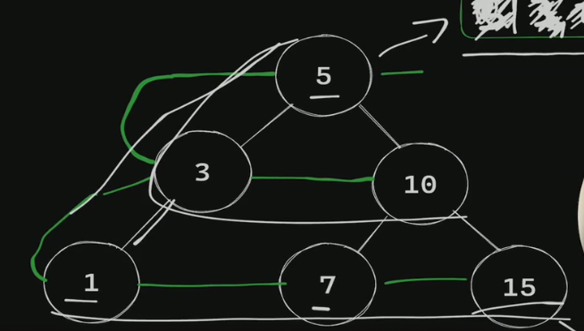

#### Graphs
- Se assemelha um pouco com o que foi visto com binary tree, principalmente na forma como é feito o transversal usando BFS
- Porem diferentemente da binary tree um node pode ter varios neighbors, ao inves de dois
- DSU é uma estrutura de dados para grafos

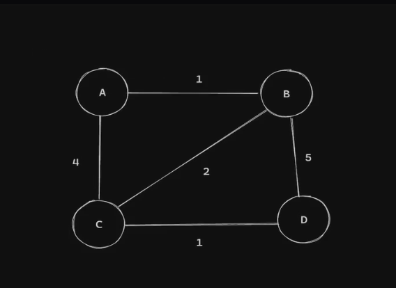

Algoritimo de dijkstra
- Usado para calcular distancia entre nodes
- Pode funcionar com complexidade de log(n)

Mais detalhes de um grafo e nomeclaturas

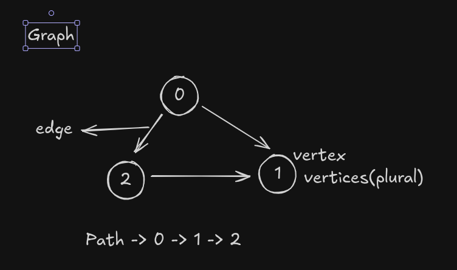

|             Termo             |   Tradução   |                                      Significado                                      |
| ----------------------------- | ------------ | ------------------------------------------------------------------------------------- |
| **Vertex (plural: vertices)** | vértice / nó | Um **ponto** do grafo — representa algo (ex: pessoa, cidade, servidor, usuário, etc.) |
| **Edge**                      | aresta       | **Conexão entre dois vértices** — pode ser uma amizade, uma estrada, um link…         |
| **Graph**                     | grafo        | Conjunto de vértices **+** arestas                                                    |
| **Adjacent**                  | adjacente    | Quando 2 vértices **estão ligados diretamente por uma aresta**                        |
| **Path**                      | caminho      | Qualquer **sequência de vértices conectados** (A → B → C)                             |
| **Connected**                 | conectado    | Quando **existe algum caminho entre dois vértices**, mesmo que indireto               |
| **Component (conexo)**        | componente   | Um **grupo isolado** dentro do grafo — não tem conexão com outros grupos              |
| **Cycle**                     | ciclo        | Quando você consegue **sair de um nó e voltar pra ele mesmo** sem repetir aresta      |

#### Stacks

- Basicamente funciona como um empilhamento, o ultimo a entrar será o primeiro a sair
- Pode ser utilizado como stack de processamento ou para substituir recursão

#### Heap

- É uma **estrutura de dados baseada em árvore binária**, mas **implementada de forma eficiente usando um array**, sem usar nós ou ponteiros explicitamente.
- Representa uma **árvore binária quase completa** (todos os níveis cheios, exceto possivelmente o último, preenchido da esquerda para a direita).
- Pelo que vi pode ser usado em problemas que precisam remover maior ou menor numero por operação, com heap da pra fazer sem executar um sort,
- melhorando o tempo do algoritmo para um O(log n).
- A relação entre pai e filhos no array é dada por:
  - **Filho esquerdo:** `2 * i + 1`
  - **Filho direito:** `2 * i + 2`
  - **Pai:** `(i - 1) // 2`
- Existem dois tipos principais:
  - **Min-Heap:** o menor valor fica sempre no topo (raiz)
    - Dependendo dos casos é melhor usar essa mesmo para numero maximo, principalmente para quantidades pequenas
    - mantendo apenas os maiores numeros na heap
  - **Max-Heap:** o maior valor fica sempre no topo (raiz)
- A propriedade do heap garante apenas a relação **pai ↔ filhos**, não uma ordenação global como em árvores de busca.
- **Inserção (heapify up):**
  - Usado quando um novo elemento entra na heap
  - O novo elemento é adicionado no final do array
  - Ele sobe comparando com o pai até a propriedade do heap ser restaurada
- **Remoção do topo (heapify down):**
  - Usado quando o topo do heap é removido ou alterado
  - O topo é removido
  - O último elemento do array é movido para o topo
  - Ele desce comparando com os filhos e trocando de posição até restaurar a propriedade do heap